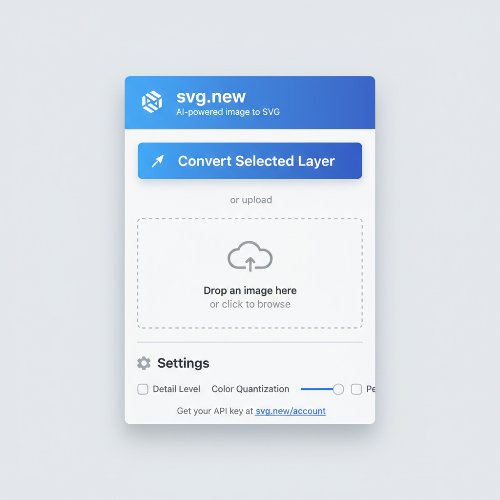

# svg.new for Figma

Convert raster images to clean SVG vectors directly in Figma using [svg.new](https://svg.new) — AI-powered vector tracing.

## Features

- **Convert selected layers** — Select any image layer, click convert, get an editable SVG inserted next to it
- **Upload images** — Drag and drop or browse for images to vectorize
- **Full-color tracing** — AI preserves all colors, not just black and white
- **Editable vectors** — Results are native Figma vector paths you can edit

## Setup

1. Install the plugin from Figma Community
2. Get an API key at [svg.new/account](https://svg.new/account)
3. Enter your key in the plugin panel

## How it works

1. Select an image layer in your Figma file (or upload one)
2. Run the plugin and click "Convert Selected Layer"
3. The image is sent to svg.new's AI vectorization engine
4. The resulting SVG is inserted as editable vector paths next to the original

## Links

- [svg.new](https://svg.new) — Web app
- [Pricing](https://svg.new/pricing) — Plans and API credits
- [API Docs](https://svg.new/developers) — REST API documentation
